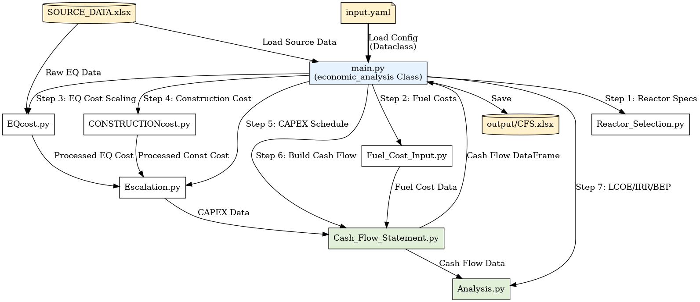

# KHT Economic Code Analysis

This document analyzes the structure, interaction, and flow of the Python code found in this project.

## 1. File Hierarchy & Interaction Flow

The project is orchestrated by the `economic_analysis` class in `main.py` (`run()` method), which executes a sequential economic analysis workflow.

## 2. Code Flow & Interaction Analysis

The execution flow in `main.py` is organized into the following logical steps:

### Step 1, 2: Initialize Input Data
- **Config**: Reads configuration from `input/data/input.yaml` and populates the `ReactorConfig` dataclass.
- **Source Data**: Loads base cost data from `SOURCE_DATA.xlsx` (EQ Cost, Currency, Scaling Factors).

### Step 2-2: Reactor Selection Output
- **Module**: `Reactor_Selection.py`
- **Action**: Calls `RS.Core()` to calculate thermal and electric capacity, core dimensions, and RPV volume based on the configuration.

### Step 3-1: Fuel Interim Storage
- **Module**: `Fuel_Cost_Input.py`
- **Action**: Calls `Fuel.InterimStorage()` to calculate the annual cost of cask storage.

### Step 3-2: Equipment (EQ) Cost Calculation
- **Module**: `EQcost.py`
- **Process**:
    1.  `convert_currency()`: Converts procurement costs to USD.
    2.  `adjust_dollar_value()`: Adjusts for inflation to 2025 USD.
    3.  `scaling()`: Applies scaling factors based on **Power Output** and **Module Number**.
    4.  `sum_by_CP()`: Aggregates costs by Cost Point (CP).

### Step 4: Construction Cost Calculation
- **Module**: `CONSTRUCTIONcost.py`
- **Process**: Calculates scaling for construction and labor costs (`CPconst`).

### Step 5: CAPEX Calculation
- **Module**: `Escalation.py`
- **Process**:
    1.  Combines EQ and Construction costs.
    2.  Applies the project schedule (`START`, `END` years).
    3.  Distributes costs and applies annual escalation rates.

### Step 6: Cash Flow Statement Calculation
- **Module**: `Cash_Flow_Statement.py`
- **Process**: Builds the Cash Flow Statement (CFS) dataframe row by row (Revenue, O&M, Fuel, CAPEX, Debt, Tax, Net Income).

### Step 7: Analysis and Save
- **Module**: `Analysis.py`
- **Process**:
    - Calculates LCOE (Levelized Cost of Electricity), IRR, and BEP.
    - Prints summary metrics to the console.
    - Saves the detailed CFS to `output/CFS.xlsx`.

## 3. Module Summary

| Module | Location | Responsibility |
| :--- | :--- | :--- |
| `main.py` | Root | **Controller**. Orchestrates the steps above. |
| `Reactor_Selection.py` | `input/code` | Physical sizing and capacity calculations. |
| `Fuel_Cost_Input.py` | `input/code` | Front-end fuel and Interim Storage costs. |
| `EQcost.py` | `input/code` | Equipment cost processing and scaling. |
| `CONSTRUCTIONcost.py` | `input/code` | Construction/Labor cost processing. |
| `Escalation.py` | `input/code` | CAPEX schedule distribution and escalation. |
| `Cash_Flow_Statement.py` | `input/code` | Financial model construction. |
| `Analysis.py` | `input/code` | Final economic metrics (LCOE, IRR). |
